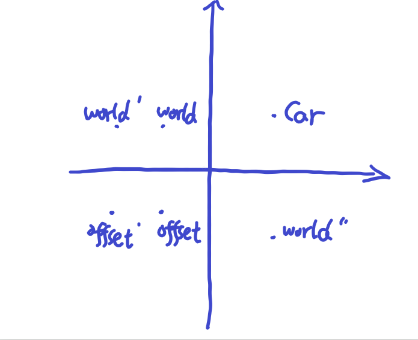

```
图上的这些单词，不带'号的表示原始位置，带一个'的表示平移以后的位置，带两个'的表示旋转以后的位置
```

因为世界实际上是复制了offsetPivot的位移，所以有
> world'- world = offset'- offset
>
>world' = offset'-offset + world
>
>world' - car = offset' - offset + world - car

在旋转以后，坐标需要乘以旋转矩阵transMatrix，所以旋转以后的:
> world'' - car = transMatrix @ (world' -car)
>
>world'' = car + transMatrix @ (offset' - offset + world -car)


