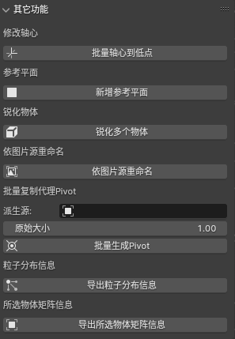

English Readme is [here](readmeEN.md)

这里是一些个人常用的小功能，写成了插件，当然随着 blender 版本的更新，有一部分功能 blender 本身已经能提供了，但还是放上来了。

插件已经基本不更新，也不维护，不过到 blender 4.1 为止，功能基本都还能用。

## 安装

将本项目以 zip 格式下载，当然 asset 文件夹可以不下载，然后在 blender 中安装插件，选择下载的 zip 文件即可。
安装完以后，在插件中搜索`HippoTools`，找到本插件，勾选启用。
接下来，在右侧工具栏中会出现 `HippoTools` 选项卡，点开即可使用。

以下是各个功能的介绍。

## 清理数据

- 约束器：删除所选物体上所有的约束器
- 空顶点组：删除所选物体上那些不包含任何顶点的空顶点组
- 材质：删除所选物体上的所有材质

## 清理材质

- 材质分类：将所选的物体，按材质生成 collection，然后将物体分别放到对应材质的 collection 里去。如果某个物体上有不止一个材质，则不会被归类。
- 玻璃处理：所选物体身上的材质如果有 alpha(透明度)不为 1 的情况，会将材质的 blend mode 自动设置为 alpha blend，以便该物体在从 blender 导出时能表现出正确的半透明效果。
- 取消透明：将所选物体身上所有材质的 alpha 设置为 1

## UV 操作

这三个小功能主要为批量烘焙物体前，重做 UV 的工作所设计的。

- 新增 UV：为所选物体新增 UV 组，名称可自定义
- 删除 UV：批量删除所选物体的某个名称的 UV 组，名称可自定义
- 保留 UV：删除所选物体上的所有 UV 组，指定名称的 UV 组除外

## 粒子动画

该功能需要两个物体，一个是带有粒子系统的粒子生成体。一个是用于派生实例的派生源。

生成粒子动画时，程序会根据派生源，先派生出和粒子数量一样多的实例，然后再复制粒子系统里每个粒子的动画，施加到每一个对应的派生出来的实例上。

比如你有一个烟火效果的粒子生成体，然后再做一个红色的小方块当成派生源，那么程序会在每个粒子的位置上生成一个红色的小方块，并且复制粒子的动画效果。

接下来，你就可以将所有派生的小方块以及它的动画导出在其它软件中使用。

## 批量修改材质属性

可以将选中的所有物体上的某些材质属性值进行统一的修改

## 其它功能

- 批量轴心到低点：将所选物体的轴心移动到该物体中心位置的最低点
- 新增参考平面：这个一个特殊情况下用的功能，一般用户用不到，具体效果可以自己试下就知道了
- 锐化物体：将所选物体的 shade smooth 变成 shade flat
- 依图片源重命名：也是一个特殊功能，一般用户用不到
- 批量复制代理 Pivot：一个特殊功能。一般操作是这样的，先搞到很多个带有旋转/缩放/位移的物体或者空轴心（一般情况下是空轴心比较合适），全选中它们，然后再选择一个别的物体做为派生源，最后点击这个功能，程序会将所有选中的物体或者空轴心处，根据所选物体或者轴心的 transform 属性，派生出一个新的物体来。
- 粒子分布信息：选中一个粒子系统，然后导出它所有粒子的静态分布信息，包括位置、旋转、缩放等信息。导出的文件可以用于其它软件的粒子效果制作。
- 导出所选物体矩阵信息：导出所选物体的位置、旋转、缩放信息，可以用于其它软件的粒子效果或者实例化效果制作。
