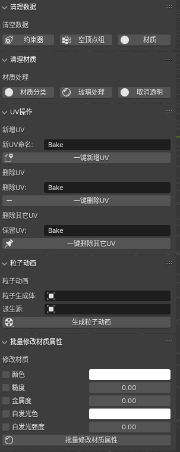

中文文档在 [这里](ReadMe.md)

Here are some personal favorite small features that have been turned into plugins. Of course, with the updates of Blender, some features have already been provided by Blender itself, but they are still included here.

The plugin is no longer updated or maintained, but the functions are basically still usable up to Blender 4.1.

## Installation

Download this project as a zip file, and of course, you can skip downloading the `asset` folder. Then install the plugin in Blender, selecting the downloaded zip file. After installation, search for `HippoTools` in the plugins, find this plugin, and enable it. Next, the `HippoTools` tab will appear in the right toolbar, which you can open to use.

Below is an introduction to each feature.

## Clean Data

- Constraints: Delete all constraints on the selected object
- Empty Vertex Groups: Delete empty vertex groups on the selected object that do not contain any vertices
- Materials: Delete all materials on the selected object

## Clean Material

- Material Classification: Generate collections based on materials for the selected objects and place them in the corresponding material collections. If an object has more than one material, it will not be categorized.
- Glass Processing: If the material on the selected object has an alpha (transparency) value not equal to 1, the blend mode of the material will be automatically set to alpha blend so that the object can display the correct translucent effect when exported from Blender.
- Cancel Transparency: Set the alpha value of all materials on the selected object to 1

## UV Operations

These three small features are mainly designed for redoing UVs before baking objects in batches.

- Add UV: Add a new UV group to the selected object, with a customizable name
- Delete UV: Batch delete a specific named UV group from the selected objects, with a customizable name
- Keep UV: Delete all UV groups on the selected object except for the specified named UV group

## Particle Animation

This feature requires two objects, first is a `particle emitter` with a particle system, and second is a `source object` for deriving instances.

When generating particle animation, the program first derives as many instances as there are particles based on the source object, and then copies the animation of each particle in the particle system to each corresponding derived instance.

For example, if you have a particle emitter for a fireworks effect and then create a red cube as the source object, the program will generate a red cube at the position of each particle and copy the particle's animation effect.

Next, you can export all the derived cubes and their animations for use in other software.

## Batch Modify Material Properties

You can uniformly modify certain material property values on all selected objects.

The properties that can be modified from top to bottom are:

- color
- roughness
- metallicity
- emissive color
- emissive intensity.

## Other Functions

- Batch Move Pivot to Lowest Point: Move the pivot of the selected objects to the lowest point of the object's center position
- Add Reference Plane: This is a special-case function, generally not needed by users, but you can try it yourself to see the effect
- Sharpen Object: Change the shade smooth of the selected object to shade flat
- Rename by Image Source: Also a special function, generally not needed by users
- Batch Copy Proxy Pivot: A special function. The general operation is like this: First, get a lot of objects with rotation/scaling/translation or empty pivots (usually empty pivots are more suitable), select them all, and then select another object as the source object. Finally, click this function, and the program will derive a new object at the position of all selected objects or empty pivots based on the transform properties of the selected objects or pivots.
- Particle Distribution Information: Select a particle system, then export its static distribution information of all particles, including position, rotation, scaling, etc. The exported file can be used for particle effect production in other software.
- Export Selected Objects' Matrix Information: Export the position, rotation, and scaling information of the selected objects, which can be used for particle effects or instancing effects production in other software.
